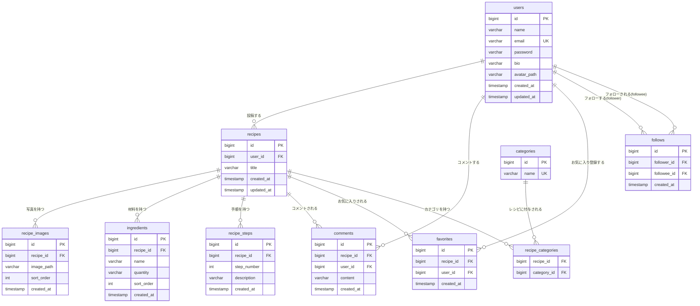

# ER図

## エンティティ関連図

## テーブル定義

### users（ユーザー）
| カラム名 | 型 | 制約 | 説明 |
|----------|----|------|------|
| id | bigint | PK | ユーザーID |
| name | varchar(50) | NOT NULL | 画面表示用の表示名 |
| email | varchar(255) | UNIQUE, NOT NULL | ログインに使用するメールアドレス |
| password | varchar(255) | NOT NULL | ハッシュ化済みパスワード |
| bio | varchar(160) | NULL可 | 自己紹介文 |
| avatar_path | varchar(255) | NULL可 | アイコン画像のローカルパス |
| created_at | timestamp | NOT NULL | 作成日時 |
| updated_at | timestamp | NOT NULL | 更新日時 |

### recipes（レシピ）
| カラム名 | 型 | 制約 | 説明 |
|----------|----|------|------|
| id | bigint | PK | レシピID |
| user_id | bigint | FK → users.id, NOT NULL | 投稿者 |
| title | varchar(100) | NOT NULL | レシピタイトル |
| created_at | timestamp | NOT NULL | 投稿日時 |
| updated_at | timestamp | NOT NULL | 更新日時 |

### recipe_images（レシピ写真）
| カラム名 | 型 | 制約 | 説明 |
|----------|----|------|------|
| id | bigint | PK | 画像ID |
| recipe_id | bigint | FK → recipes.id, NOT NULL | 紐づくレシピ |
| image_path | varchar(255) | NOT NULL | ローカルディスク上の画像パス |
| sort_order | int | NOT NULL | 表示順 |
| created_at | timestamp | NOT NULL | 作成日時 |

### ingredients（材料）
| カラム名 | 型 | 制約 | 説明 |
|----------|----|------|------|
| id | bigint | PK | 材料ID |
| recipe_id | bigint | FK → recipes.id, NOT NULL | 紐づくレシピ |
| name | varchar(50) | NOT NULL | 材料名（材料名検索の対象） |
| quantity | varchar(30) | NULL可 | 分量（例: "200g"、"大さじ1"） |
| sort_order | int | NOT NULL | 表示順 |
| created_at | timestamp | NOT NULL | 作成日時 |

### recipe_steps（手順）
| カラム名 | 型 | 制約 | 説明 |
|----------|----|------|------|
| id | bigint | PK | 手順ID |
| recipe_id | bigint | FK → recipes.id, NOT NULL | 紐づくレシピ |
| step_number | int | NOT NULL | 手順の順序（1始まり） |
| description | varchar(500) | NOT NULL | 手順の説明文 |
| created_at | timestamp | NOT NULL | 作成日時 |

### categories（カテゴリマスタ）
| カラム名 | 型 | 制約 | 説明 |
|----------|----|------|------|
| id | bigint | PK | カテゴリID |
| name | varchar(30) | UNIQUE, NOT NULL | カテゴリ名（例: "和食"、"デザート"）。初期シーディングで固定投入 |

### recipe_categories（レシピ×カテゴリ中間テーブル）
| カラム名 | 型 | 制約 | 説明 |
|----------|----|------|------|
| recipe_id | bigint | FK → recipes.id, NOT NULL | レシピ |
| category_id | bigint | FK → categories.id, NOT NULL | カテゴリ |

制約: `PRIMARY KEY(recipe_id, category_id)` — 同一レシピへの同一カテゴリの重複付与を防止

### comments（コメント）
| カラム名 | 型 | 制約 | 説明 |
|----------|----|------|------|
| id | bigint | PK | コメントID |
| recipe_id | bigint | FK → recipes.id, NOT NULL | コメント対象のレシピ |
| user_id | bigint | FK → users.id, NOT NULL | コメント投稿者 |
| content | varchar(200) | NOT NULL | コメント本文 |
| created_at | timestamp | NOT NULL | コメント日時 |

### favorites（お気に入り）
| カラム名 | 型 | 制約 | 説明 |
|----------|----|------|------|
| id | bigint | PK | お気に入りID |
| recipe_id | bigint | FK → recipes.id, NOT NULL | お気に入り対象のレシピ |
| user_id | bigint | FK → users.id, NOT NULL | お気に入り登録したユーザー |
| created_at | timestamp | NOT NULL | 登録日時 |

制約: `UNIQUE(recipe_id, user_id)` — 同一ユーザーによる同一レシピへの重複お気に入りを防止

### follows（フォロー関係）
| カラム名 | 型 | 制約 | 説明 |
|----------|----|------|------|
| id | bigint | PK | フォローID |
| follower_id | bigint | FK → users.id, NOT NULL | フォローする側のユーザー |
| followee_id | bigint | FK → users.id, NOT NULL | フォローされる側のユーザー |
| created_at | timestamp | NOT NULL | フォロー日時 |

制約: `UNIQUE(follower_id, followee_id)` — 同一ユーザーへの重複フォローを防止。`follower_id <> followee_id` を満たすこと（自己フォロー禁止）
