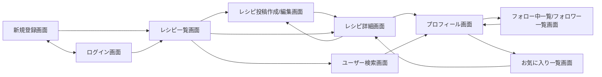

# 画面設計

## 画面一覧

| No | 画面名 | 概要 | 認証要否 |
|----|--------|------|---------|
| 1 | 新規登録画面 | メールアドレス／パスワードでの新規登録 | 不要 |
| 2 | ログイン画面 | メールアドレス／パスワードでのログイン | 不要 |
| 3 | レシピ一覧画面 | 全レシピの新着順一覧、キーワード／材料名検索、カテゴリ絞り込み（メイン画面） | 不要（閲覧・検索は未ログインでも可） |
| 4 | レシピ投稿作成/編集画面 | タイトル・材料・手順・写真・カテゴリでレシピを作成／編集 | 必要 |
| 5 | レシピ詳細画面 | 写真・材料・手順・コメント一覧・お気に入りボタン | 不要（閲覧は未ログインでも可、お気に入り・コメントはログイン必要） |
| 6 | プロフィール画面 | ユーザー情報・投稿レシピ一覧・フォロー中/フォロワー数 | 必要 |
| 7 | フォロー中一覧／フォロワー一覧画面 | フォロー中／フォロワーのユーザー一覧 | 必要 |
| 8 | お気に入り一覧画面 | 自分がお気に入り登録したレシピ一覧 | 必要 |
| 9 | ユーザー検索画面 | 表示名でのユーザー検索 | 必要 |

## 各画面の詳細

### 1. 新規登録画面
- 表示要素: メールアドレス入力欄、パスワード入力欄、表示名入力欄、登録ボタン、ログイン画面への導線リンク
- 主な操作: 入力内容を送信して新規登録
- 遷移先: 登録成功 → レシピ一覧画面 / ログインへのリンク → ログイン画面

### 2. ログイン画面
- 表示要素: メールアドレス入力欄、パスワード入力欄、ログインボタン、新規登録画面への導線リンク
- 主な操作: ログイン
- 遷移先: ログイン成功 → レシピ一覧画面 / 新規登録へのリンク → 新規登録画面

### 3. レシピ一覧画面
- 表示要素: 検索ボックス（キーワード／材料名）、カテゴリフィルタチップ、レシピカード一覧（サムネイル画像・タイトル・投稿者名・お気に入り数）、レシピ投稿画面への導線
- 主な操作: キーワード／材料名検索、カテゴリ絞り込み、レシピカードクリックで詳細へ遷移、投稿者名クリックでプロフィールへ遷移
- 遷移先: レシピカードクリック → レシピ詳細画面 / 投稿者名クリック → プロフィール画面 / 投稿ボタン → レシピ投稿作成画面

### 4. レシピ投稿作成/編集画面
- 表示要素: タイトル入力欄、材料入力欄（材料名＋分量、行の追加／削除）、手順入力欄（順序付き、行の追加／削除／並び替え）、写真添付ボタン（複数選択可）、添付写真プレビュー、カテゴリ選択（複数選択チェックボックス／チップ）、保存ボタン
- 主な操作: 各項目の入力・追加・削除、写真添付・削除、カテゴリ選択、保存
- 遷移先: 保存完了 → レシピ詳細画面

### 5. レシピ詳細画面
- 表示要素: レシピタイトル・写真（複数枚）、材料一覧、手順一覧（順序付き）、カテゴリタグ、お気に入り数・お気に入りボタン、コメント一覧（コメント投稿者アイコン・表示名・本文）、コメント投稿フォーム、投稿者本人の場合は編集・削除ボタン
- 主な操作: お気に入り登録／解除、コメント投稿、投稿者・コメント投稿者名クリックでプロフィールへ遷移、投稿者本人の場合はレシピ編集・削除
- 遷移先: ユーザー名クリック → プロフィール画面 / 編集ボタン → レシピ投稿作成/編集画面

### 6. プロフィール画面
- 表示要素: アイコン・表示名・自己紹介、フォロー中数・フォロワー数、本人の投稿レシピ一覧、フォロー/フォロー解除ボタン（他ユーザー閲覧時のみ）、プロフィール編集ボタン（本人閲覧時のみ）、お気に入り一覧への導線（本人閲覧時のみ）
- 主な操作: フォロー／フォロー解除、フォロー中/フォロワー数クリックで一覧表示、プロフィール編集
- 遷移先: フォロー中/フォロワー数クリック → フォロー中一覧／フォロワー一覧画面 / レシピカードクリック → レシピ詳細画面

### 7. フォロー中一覧／フォロワー一覧画面
- 表示要素: ユーザー一覧（アイコン・表示名・フォローボタン）
- 主な操作: フォロー／フォロー解除、ユーザークリックでプロフィールへ遷移
- 遷移先: ユーザークリック → プロフィール画面

### 8. お気に入り一覧画面
- 表示要素: 自分がお気に入り登録したレシピカード一覧（サムネイル画像・タイトル・投稿者名）
- 主な操作: レシピカードクリックで詳細へ遷移、お気に入り解除
- 遷移先: レシピカードクリック → レシピ詳細画面

### 9. ユーザー検索画面
- 表示要素: 検索ボックス、検索結果一覧（アイコン・表示名・フォローボタン）
- 主な操作: キーワード入力・検索、フォロー／フォロー解除、ユーザークリックでプロフィールへ遷移
- 遷移先: ユーザークリック → プロフィール画面

## 画面遷移図

